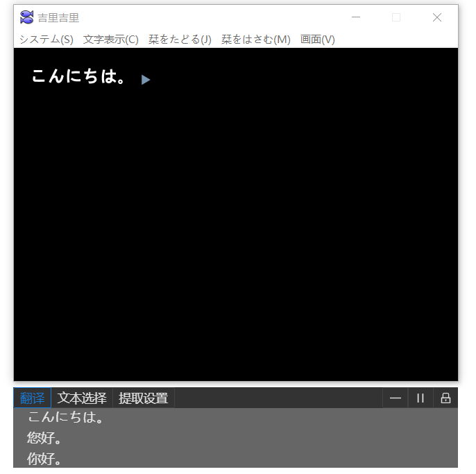

# Ame - Visual Novel Translator
[](https://github.com/nzh63/Ame/actions/workflows/build.yml)
[](https://github.com/nzh63/Ame/actions/workflows/release.yml)
[](https://github.com/nzh63/Ame/actions/workflows/codeql-analysis.yml)



## 功能
* 从正在运行的游戏中提取文本，支持Hook方式与OCR方式。
* 从翻译器中获取机器翻译结果，包括：
  * 离线翻译器（JBeijing与Dr.eye）
    * 离线翻译器需要自行购买与安装。
  * 若干在线翻译器
* 使用语音合成朗读原文、译文。
* 翻译窗口随游戏窗口移动。
* 图形化的、易于配置的设置界面。

## 编译与运行
1. 首先安装[node.js](https://nodejs.org/en/)(v12+)、[yarn](https://yarnpkg.com/)，然后：
2. 然后安装[python](https://www.python.org/)与[Visual Studio](https://visualstudio.microsoft.com/vs)，可以通过执行`yarn global add windows-build-tools`来安装它们。
3. 执行以下命令即可进行开发与调试。
    ```cmd
    git clone https://github.com/nzh63/Ame
    cd Ame
    yarn
    yarn dev
    yarn build
    ```

## 贡献
遵循一般的fork，branch，commit ，Pull request的流程。

## 想要添加新的翻译器？
请参考[贡献](#贡献)一节，翻译器相关代码在[src/main/providers](./src/main/providers)下，实现相关逻辑即可，程序会自动根据选项的schema生成配置界面。

## License
MIT
