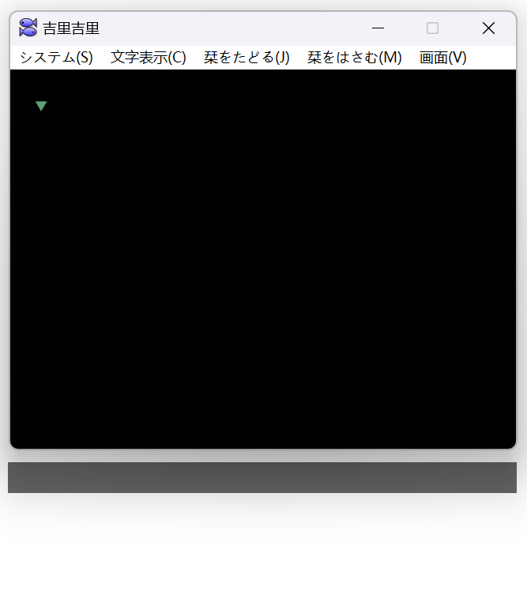

# Ame - Visual Novel Translator

[](https://github.com/nzh63/Ame/actions/workflows/build.yml)
[](https://github.com/nzh63/Ame/actions/workflows/release.yml)
[](https://github.com/nzh63/Ame/actions/workflows/codeql-analysis.yml)
[](https://app.fossa.com/projects/git%2Bgithub.com%2Fnzh63%2FAme?ref=badge_shield)



## 功能

- 从正在运行的游戏中提取文本，支持Hook方式与OCR方式。
- 从翻译器中获取机器翻译结果，包括：
  - 离线翻译器（JBeijing与Dr.eye）
    - 需要自行购买与安装。
  - 在线翻译器
    - 可能需要付费与 API key
  - 大语言模型
    - 可能需要付费与 API key
- 使用语音合成朗读原文、译文。
- 翻译窗口随游戏窗口移动。
- 图形化的、易于配置的设置界面。

## 编译与运行

1. 首先安装[node.js](https://nodejs.org/en/)(v20+)，安装过程中请勾选“Tools for Native Modules”。
2. 启用[corepack](https://yarnpkg.com/corepack)。
3. 执行以下命令即可进行开发与调试。
   ```cmd
   git clone https://github.com/nzh63/Ame
   cd Ame
   yarn
   yarn dev
   yarn build
   ```

## 贡献

遵循一般的fork，branch，commit，pull request的流程。

## 想要添加新的翻译器？

请参考[贡献](#贡献)一节，翻译器相关代码在[src/main/providers](./src/main/providers)下，实现相关逻辑即可，程序会自动根据选项的schema生成配置界面。

## License

MIT

[](https://app.fossa.com/projects/git%2Bgithub.com%2Fnzh63%2FAme?ref=badge_large)
