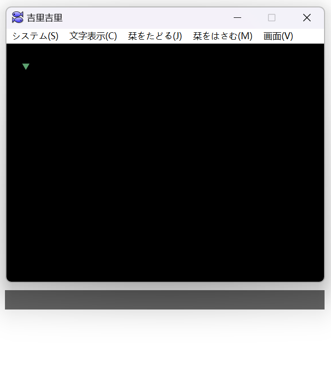

# Ame - Visual Novel Translator

[](https://github.com/nzh63/Ame/actions/workflows/build.yml)
[](https://github.com/nzh63/Ame/actions/workflows/release.yml)
[](https://github.com/nzh63/Ame/actions/workflows/codeql-analysis.yml)
[](https://app.fossa.com/projects/git%2Bgithub.com%2Fnzh63%2FAme?ref=badge_shield)



## 功能

- 从正在运行的游戏中提取文本，支持Hook方式与OCR方式。
- 从翻译器中获取机器翻译结果，包括：
  - 离线翻译器（JBeijing与Dr.eye）
    - 需要自行购买与安装。
  - 在线翻译器
    - 可能需要付费与 API key
  - 大语言模型
    - 可能需要付费与 API key
- 使用语音合成朗读原文、译文。
- 翻译窗口随游戏窗口移动。
- 图形化的、易于配置的设置界面。

## 项目结构

- `src/` —— 前端
- `src-tauri/` —— Rust 后端
  - `src/` —— Rust 源码
  - `native/` —— C++ 原生代码
- `e2e/` —— Playwright E2E 测试

## 编译与运行

1. 安装 [Visual Studio 2022](https://visualstudio.microsoft.com/downloads/)、
   [cmake](https://cmake.org/download/)、[node.js](https://nodejs.org/en/download)(v20+)
   和 [Rust](https://www.rust-lang.org/tools/install)（stable + MSVC toolchain）。
2. 启用 [corepack](https://yarnpkg.com/corepack)。
3. 执行以下命令即可进行开发与调试。
   ```cmd
   git clone https://github.com/nzh63/Ame
   cd Ame
   yarn
   yarn dev
   ```
   首次构建时 `cargo build` 会自动下载 Textractor 等运行时依赖，无需手动执行额外的下载命令。

## 构建与测试

```cmd
yarn build          # 调试构建（Vite + cargo build）
yarn tauri:build    # 发布构建并生成 NSIS 安装包
yarn test           # Rust 单元测试（cargo test）
yarn e2e            # Playwright E2E 测试
```

## 贡献

遵循一般的fork，branch，commit，pull request的流程。

## 想要添加新的翻译器？

请参考[贡献](#贡献)一节，翻译器相关代码在 [src-tauri/src/providers/translate](./src-tauri/src/providers/translate) 下，
实现 `TranslateProvider` trait 并注册到 `src-tauri/src/commands/options.rs` 即可，
程序会自动根据 `options_schema()` 与 `options_description()` 生成配置界面。

## License

MIT

[](https://app.fossa.com/projects/git%2Bgithub.com%2Fnzh63%2FAme?ref=badge_large)
